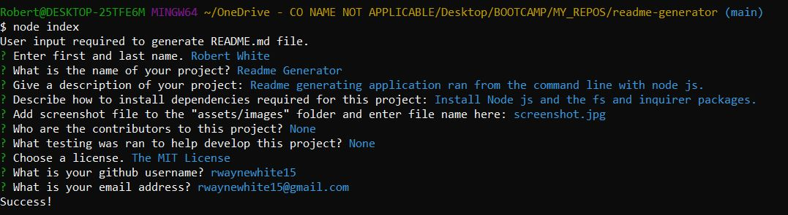

# Readme Generator

  ## This application uses the command line to gather input from a user and generate a readme file for a project.

   

  # Table of Contents:
  * [Title](#Title)
  * [Description](#Description)
  * [Installation](#Installation)
  * [Usage](#Usage)
  * [Contribution](#Contribution)
  * [Tests](#Tests)
  * [Usage](#Usage)
  * [License](#License)
  * [Github](#Github)
  * [Email](#Email)
  
  # Owned By:
  Robert White

  # Installation
  Install node js. Install fs and inquirer packages.

  # Usage
  
  
  # Contribution
  None

  # Tests
  None
  
  # License
  
   
  The MIT License
  
   

  # Please Contact me with any questions

  # Github
  Please visit my [GitHub](https://github.com/rwaynewhite15) to view my work.
  
  # Email
  ## rwaynewhite@gmail.com